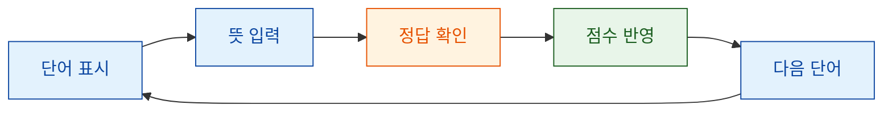

# 🧠 Vocabulary Quiz App

영어 단어를 보고 한국어 뜻을 입력하며 학습할 수 있는 간단한 Tkinter 단어 퀴즈 앱입니다.  
GUI 환경에서 단어를 하나씩 풀어보고, 정답 여부와 점수를 바로 확인할 수 있습니다.

## 📌 Overview

Vocabulary Quiz App은 영어 단어를 짧은 반복 퀴즈 방식으로 학습하기 위한 미니 학습 앱입니다.

현재는 랜덤으로 단어를 보여주고, 사용자가 뜻을 입력하면 즉시 정답 여부를 확인하는 기본 흐름을 제공합니다.  
향후 오답 복습, 단어장 관리, 학습 기록 저장 기능을 추가하면 더 실용적인 개인 단어 학습 도구로 확장할 수 있습니다.



## ✨ Features

- 랜덤 영어 단어 표시
- 한국어 뜻 입력
- 입력한 답안 즉시 채점
- 정답/오답 피드백 표시
- 점수 누적 표시
- 다음 단어로 이동

## 🚀 Quick Start

앱을 실행합니다.

```bash
python -m vocabulary_quiz_app.main
```

실행하면 Tkinter 기반 단어 퀴즈 창이 열립니다.

## ✅ Test

테스트는 다음 명령어로 실행합니다.

```bash
pytest -q
```

## 📁 Project Structure

```text
vocabulary_quiz_app/
├─ app.py        # Tkinter GUI 앱
├─ data.py       # 기본 단어 목록
├─ quiz_logic.py # 단어 선택 및 채점 로직
└─ __main__.py   # python -m 실행 진입점
```

## 🗺️ Roadmap

Vocabulary Quiz App은 기본적인 단어 퀴즈 흐름을 구현한 상태입니다.  
더 실용적인 학습 도구로 발전하기 위해 다음 기능들이 필요합니다.

- 단어 난이도 선택
- 카테고리별 단어장
- 틀린 단어 복습 모드
- 단어 추가, 수정, 삭제 UI
- 예문 표시
- 발음 또는 발음 기호 표시
- 학습 기록 저장
- 정답률 통계
- 더 명확한 피드백 메시지
- 테스트 케이스 보강

## 🤝 Help Wanted

이 프로젝트는 더 좋은 단어 학습 앱으로 발전하기 위한 기여를 기다리고 있습니다.

작은 개선도 충분히 의미 있습니다.  
오타 수정, 버튼 배치 개선, 피드백 문구 정리처럼 작은 PR부터 오답 복습, 단어장 관리, 학습 기록 저장 같은 기능 확장까지 모두 환영합니다.

특히 아래 작업에 대한 기여가 필요합니다.

- 🔁 오답 복습 기능 추가
- 🧩 단어 난이도/카테고리 선택 UI
- ➕ 단어 추가 및 삭제 기능
- 💾 학습 기록 저장
- 📊 정답률 통계 표시
- 🛠️ 입력 오류 메시지 개선
- 🧪 퀴즈 로직 테스트 보강
- 📚 README와 사용 방법 문서 개선

새로운 아이디어가 있다면 이슈로 제안하거나 PR로 직접 구현해 주세요.  
작은 개선이 쌓이면 이 프로젝트를 더 자연스럽고 실용적인 단어 학습 앱으로 만들 수 있습니다.
